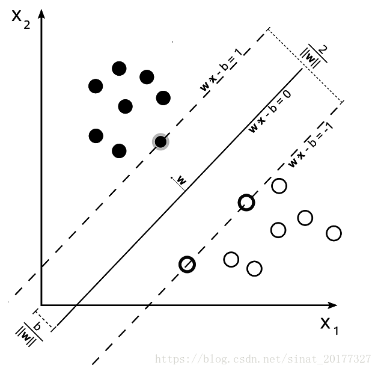
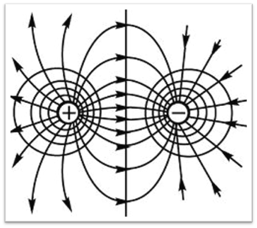
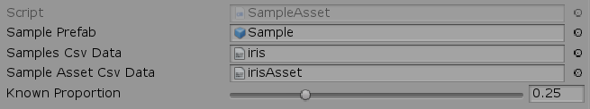
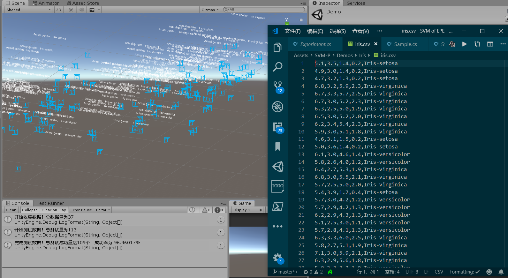

# 基于电势的支持向量机模型

## 参考资料

本文中部分图文参考自以下文章

[支持向量机（SVM）入门理解与推导](https://blog.csdn.net/sinat_20177327/article/details/79729551)

[凸优化问题，凸二次规划问题 QP，凸函数](https://blog.csdn.net/promisejia/article/details/81241201)

[电势和电势差、电场强度](https://wenku.baidu.com/view/f1bad338a7c30c22590102020740be1e650ecc8e.html)

[你的第一个机器学习案例](https://blog.csdn.net/keyi_s/article/details/79085500)

[机器学习数据网](https://archive.ics.uci.edu/ml/index.php)

## 支持向量机是什么？

支持向量机所做的就是“分类”。

参照如下所示的莲花分类数据，每行前四个数据是某个莲花的莲叶宽度等数据，最后一个数据则是莲花的已知种类。

```matlab
data={
    6.8,3.0,5.5,2.1,"Iris-virginica";
    5.7,2.5,5.0,2.0,"Iris-virginica";
    5.7,3.0,4.2,1.2,"Iris-versicolor";
    5.7,2.9,4.2,1.3,"Iris-versicolor";
    }
```

那么，如果给出一组未知种类的莲花数据，如 {6.2,2.9,4.3,1.3}，那么这支莲花的种类如何呢？

> 支持向量机模型利用这一系列已知数据，得到一个关于各个参数与莲花种类的分类函数。

传统的支持向量机又将分类需求分为线性可分、近似线性可分、线性不可分三种情况。

### 线性可分情况下的分类思路

SVM 的思想是得到一个将数据正确划分并且间隔最大的分界线（或者说，**超平面**）。

我们先来看看，当只有两个参数的情况：

我们将两类数据用正负号区分，目标分类函数设为 _y=W·X+b_ 。在 y=1 时，函数与某个+1 数据相交。当 y=-1 时，函数与某个-1 数据相交。如果 _y·W·X+b<1_ 的区域（如图所示的两个虚线）内没有任何一个点存在，那么这个区域的间距正是分界线的间隔。当 y=0 时，函数处于这个区域正中心，这个函数就是分界线本身（如图所示的实线）。

接下来，我们可利用数学知识，得到 _W·X+b=-1_ 与 _W·X+b=+1_ 两条虚线之间的间距为 _2/||W||_，同时对于任何一个样本点， _y·W·X+b>=1_ （两条虚线线的区域内没有任何一个点存在），求出让间距最大化的系数取值方法 Max(2/||W||)，就可以得到我们的超平面公式了！

## SVM-P 基于电势原理的支持向量机模型

“势”是一种自然规律中异性同性相斥相吸的体现。根据电势能原理，结合传统支持向量机的分类思路，我们或许可以构造一种不同的分类模型

对于两个等大小、极性相反的电荷，在两个电荷产生的电势等效处，可以视作两个电荷影响范围的分界处。越接近正电荷，电势越向正偏移；越接近负电荷，电势越向负偏移。


与传统 SVM 的思想类似，SVM-P 的思想也是找到了一个分隔间距最大的分割线。但是 SVM-P 的计算思路更为直接：寻找各个不同样本的电势等效处。如果某处受正极电荷的电势影响更大，则更有可能是正极电荷，反之亦然。

### 电势算法

假设每一个实验值的电荷量绝对值都为 1

电场力公式： _f= kQq/(r^2)_
电势绝对值公式： _e= |kQ/r|=k/r_

电势具有可叠加性和相对性。
我们设无限远处的电势为 0，而空间内某一位置的电势相当于空间中所有位置的电荷在此处的电势之和。
可以得到某一位置下，某一极性所有电荷在此处的总电势算法为：

```csharp
/// <summary>
/// 计算某个极性的所有电荷在某个状态点的电势。
/// </summary>
/// <param name="target"> 目标状态点</param>
/// <param name="gender">极性</param>
/// <returns></returns>
public float CalculateElecticPotential(Status target, int gender)
{
    //获得所有该极性的电子的总电势
    var genderStatuses = samples[gender].ConvertAll((sample) => sample.status);
    var totalEP = 0f;
    //计算总电势
    foreach (var genderStatus in genderStatuses)
    {
        var delta = genderStatus - target;
        var r = delta.magnitude;//得到距离
        if (r == 0)
        {
            return float.MaxValue;
        }
        //e=1/r
        totalEP += 1 / r;//将genderStatus在当前target位置的电势叠加到总电势中
    }
    return totalEP;
}
```

### 实例检验

我利用 Unity 引擎编写了 SVM-P 的处理程序。
实验配置图：

在这次实验中，我使用了从 [机器学习数据网站](https://archive.ics.uci.edu/ml/index.php)中下载的莲花数据来进行测试。
用于得到分类公式的数据占总数据量的 25%。

实验结果图：
可以看到，总共 113 朵待测试莲花中，109 个朵莲花被正确分类，成功率达 96.46%
